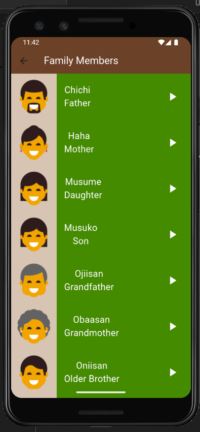

# Language Learning App

>A cross-platform Flutter application to help users learn new languages through interactive lessons, audio, and visual aids.

## Table of Contents
- [Overview](#overview)
- [Features](#features)
- [Screenshots](#screenshots)
- [Getting Started](#getting-started)
- [Project Structure](#project-structure)
- [Assets](#assets)
- [How to Run](#how-to-run)

## Overview

The Language Learning App is designed to make language acquisition fun and effective. It provides categorized vocabulary, audio pronunciations, and engaging UI components to help users learn numbers, colors, family members, and phrases in a new language.

## Features
- Clean and intuitive user interface
- Categorized vocabulary (Numbers, Colors, Family Members, Phrases)
- Audio pronunciations for each word/phrase
- Visual aids with images for better retention
- Responsive design for mobile and desktop
- Easily extendable for more languages and categories

## Screenshots




## Getting Started

### Prerequisites
- [Flutter SDK](https://flutter.dev/docs/get-started/install)
- Dart SDK (comes with Flutter)
- Android Studio, VS Code, or any preferred IDE

### Installation
1. **Clone the repository:**
	```sh
	git clone <repository-url>
	cd language_learning_app
	```
2. **Install dependencies:**
	```sh
	flutter pub get
	```
3. **Run the app:**
	```sh
	flutter run
	```

## Project Structure

```
lib/
  main.dart                # App entry point
  components/              # Reusable UI components (category_item, item)
  models/                  # Data models (number.dart)
  screens/                 # App screens (home, numbers, colors, family members)
assets/
  images/                  # Image assets for categories
  sounds/                  # Audio files for pronunciations
```

## Assets
- **Images:** Located in `assets/images/` (numbers, colors, family members)
- **Sounds:** Located in `assets/sounds/` (numbers, colors, family members, phrases)

## How to Run

1. Ensure you have Flutter installed and set up.
2. Connect a device or start an emulator.
3. Run `flutter pub get` to fetch dependencies.
4. Use `flutter run` to launch the app.
